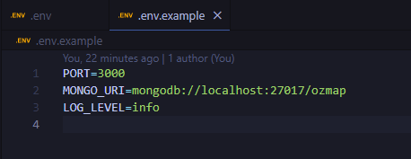
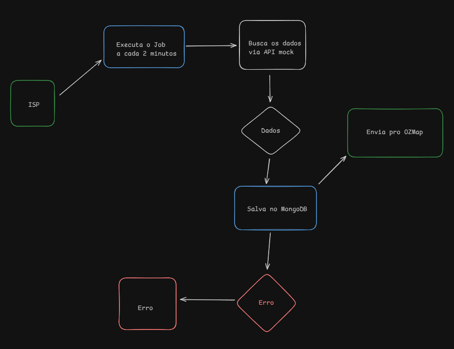
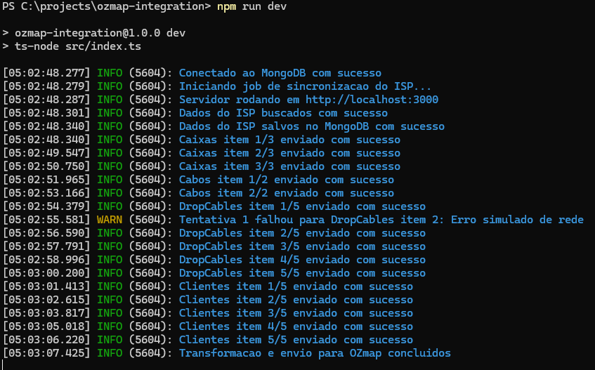
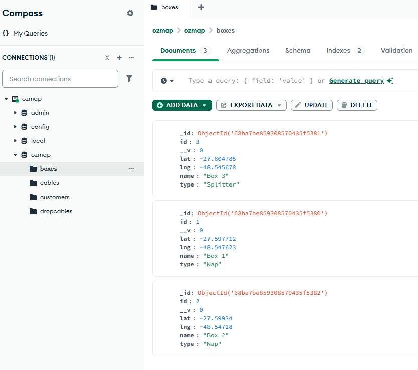

# 📌 OZMap Integration - Desafio Técnico OZMap - Desenvolvedor Backend

Este projeto implementa um serviço em Node.js/TypeScript que integra dados de um sistema ISP simulado com o sistema **OZmap**.

---

## 🛠️ Tecnologias Utilizadas

| Tecnologia | Motivo do uso |
|------------|---------------|
| **Node.js** | Execução JavaScript no backend |
| **TypeScript** | Tipagem estática, aumentando a segurança e manutenibilidade do código. |
| **Express** | Framework minimalista para criação de APIs e servidores HTTP de forma rápida e organizada. |
| **Docker** | Executar o MongoDB em container, garantindo facilidade de setup. |
| **MongoDB** | Banco de dados NoSQL utilizado para armazenar os dados do ISP. |
| **Mongoose** | Biblioteca de modelagem de dados para MongoDB. |
| **Axios** | Cliente HTTP para fazer requisições ao mock da API do ISP. |
| **dotenv** | Gerenciar variáveis sensíveis. |
| **json-server** | Ferramenta para simular rapidamente uma API REST a partir de um arquivo JSON. |
| **Pino** | Biblioteca de logs. |
| **ts-node** | Permite executar arquivos TypeScript diretamente sem precisar compilá-los manualmente. |

---

## 📂 Funcionalidades

-  **Consumo de dados do ISP: cabos, caixas, cabos drop e clientes via mock JSON (json-server).**
-  **Persistência no MongoDB com atualizações incrementais (upsert).**
-  **Envio para OZmap com rate limit e tentativas de retry em caso de falha.**
-  **Agendamento periódico a cada 2 minutos para manter os dados sincronizados.**
-  **Logging estruturado em português usando Pino, incluindo erros e status de cada item processado.**

---

## 📄 Como rodar o projeto

### 1. Clone o repositório

- git clone https://github.com/jpmedeiross/ozmap-integration.git

- cd ozmap-integration 

### 2. Instale as dependências

- npm install

### 3. Criar e iniciar o container do MongoDB:

- docker run -d --name ozmap-mongo -p 27017:27017 -e MONGO_INITDB_DATABASE=ozmap mongo:7
- docker ps

### 4. Crie um .env na raiz do projeto

### 5. Rodar o mock da API do ISP

- npx json-server --watch db.json --port 4000

### 6. Você terá acesso ao seguintes endpoints:

- http://localhost:4000/cables
- http://localhost:4000/drop_cables
- http://localhost:4000/boxes
- http://localhost:4000/customers
 
### 7. Inicie o backend

- npm run dev

### 7. Teste a rota de health (Deve retornar: { "status": "ok" })

- http://localhost:3000/health

---

## 🔑 Fluxo de Dados

### 📋 1. Fluxo geral

1. O job periódico executa fetchIspData a cada 2 minutos.
2. Os dados do ISP são buscados via API mock (json-server).
3. Dados são salvos no MongoDB usando upsert.
4. Cada item é enviado para o OZmap via função simulada (mockSendToOzmap) respeitando rate limit e retries.
5. Logs detalhados indicam sucesso, falhas e retries.

### 📋 2. Demonstração dos Logs:

### 📋 3. Demonstração dos Dados no Banco:

---

### Desenvolvido por **João Pedro** para o processo seletivo da **OZMap**.
